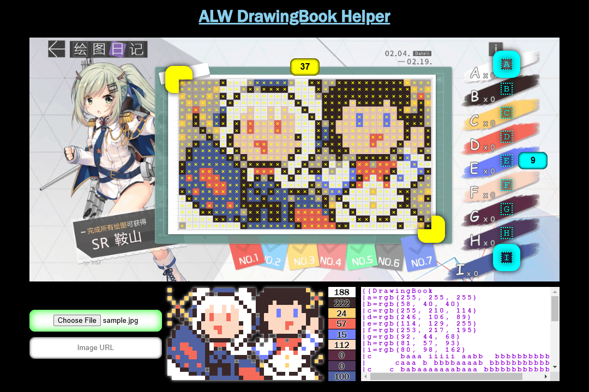

# azur-drawingbook

A [DrawingBook](https://azurlane.koumakan.jp/wiki/Template:DrawingBook) template generator for [Azur Lane Wiki](https://azurlane.koumakan.jp/).

## What It Does

It takes an image like this:


And creates a MediaWiki template like this:

```wiki
{{DrawingBook
|a=rgb(255, 255, 255)
|b=rgb(58, 40, 40)
|c=rgb(255, 210, 114)
|d=rgb(246, 106, 89)
|e=rgb(114, 129, 255)
|f=rgb(253, 217, 195)
|g=rgb(92, 44, 68)
|h=rgb(81, 57, 93)
|i=rgb(80, 98, 162)
|c     baaa iiiii aabb  bbbbbbbbbbc   
|     caaa b bbbbaaaab bbbbbbbbbbbbc c
|c   c babaaaaaaabaaa bbbbbbbbbbbbb d 
| c c  abaaaaaaaaabaaabbbbfbbbbfbbbcbc
|  d   iaaafaafafaabaabbbffffffffbc b 
| cbc ibaaffaafaffaababbbffefffefbbbb 
|c b cibabfdfffdffaaab bfffefffeffbbb 
|   b caabfdfffdffaaabibffffffffffbffb
|c   b abfffffffffbaabibbffffddfffbffb
|  biibabfffddfffffaaibbbffffdfffbfffb
| biiiibabfffdffffbaab bbbffffffb afb 
| biiiiib bffffffbaab   b  bbbbb beaab
|biiiiiiib bbbbb aab  ba abdd dddaaeaa
|biiddiiiibadddabababba aaedddddbaaaeb
|ididddiiibab baabaaaeaaaaebdadbaeaab 
|iiiidddiibbiiibaaaab eaaebdaaadaaab  
|bidiiddiibibibiibbb b eebaaacaaabb  c
|abiiiiiiibiibiii iii b baaaaaaaaab cb
|aabidiidibbbbbbibiiiibcabaaacaaabb   
|aaabbiiii bbibbibddddibaabaaaaabaab  
|aaaaabbibibbibbibdddddbaaabbabbaaaab 
| aaaaaaaabiiiiiiibdddddbbaaaaaaabaacb
}}
```

Which can be added to a Painting Gallery section like this:

```wiki
== Painting Gallery ==
<tabber>
...
|-|
Nº 7=
{{DrawingBook
...
}}
</tabber>
```

This particular example was taken from painting Nº 7 of the [Happy Lunar New Year 2021](https://azurlane.koumakan.jp/wiki/Happy_Lunar_New_Year_2021#Painting_Gallery) event page.

## How To Use



1. Select an image via file upload or URL.
   - Some URLs may be denied due to Cross-Origin Resource Sharing policy. For these cases, download the image and upload it instead.
2. Drag the yellow handles to opposite corners of the pixel grid.
   > Any orientation works. The handles can move around each other without issue.
3. Scrub the yellow box to reflect the number of pixel grid columns.
   > The box turns red and is overridden by an upper bound if columns get too thin. Columns will also squish to prevent exceeding 64 rows.
4. Drag the cyan handles to the first and last palette swatches.
5. Scrub the cyan box to reflect the number of palette swatches.
   > Several pixels are sampled around each letter position to determine proper color in case of lossy compression.
6. Review and copy the results at the bottom.
